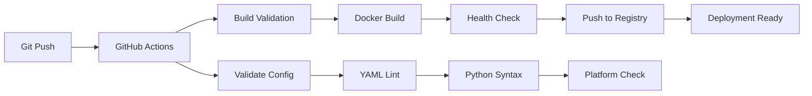

# BUILD.md

## Prerequisites

### System Requirements
- **Python**: 3.11+ with pip and venv support
- **Docker**: Latest version with BuildKit support
- **Git**: For version control and CI/CD triggers
- **Platform**: Linux/macOS (development), AMD64/X86_64 (deployment)

### Development Tools
- **Code Editor**: VSCode, PyCharm, or similar with Python support
- **Terminal**: Bash/Zsh for script execution
- **GitHub CLI**: Optional, for automated workflows
- **Docker Compose**: For multi-container orchestration

### Environment Setup
```bash
# Local development setup
./setup.sh                    # Linux/macOS
setup_windows.bat             # Windows

# Verify installation
python --version              # Should be 3.11+
docker --version              # Should support BuildKit
docker-compose --version      # Should be v2.x
```

## Build Commands

### Local Development
```bash
# Start MCP server (STDIO transport)
python -m crawl4ai_mcp.server

# Start with HTTP transport
python -m crawl4ai_mcp.server --transport http --host 127.0.0.1 --port 8000

# Start Pure HTTP server (recommended)
./scripts/start_pure_http_server.sh

# Run with custom config
export FASTMCP_LOG_LEVEL=DEBUG
python -m crawl4ai_mcp.server
```

### Docker Development
```bash
# CPU-Optimized build (recommended for VPS)
docker-compose -f docker-compose.cpu.yml build
docker-compose -f docker-compose.cpu.yml up -d

# Standard build (full features)
docker-compose build
docker-compose up -d

# Ultra-lightweight build
docker build -f Dockerfile.lightweight -t crawl4ai-mcp:lightweight .

# RunPod serverless build
docker build -f Dockerfile.runpod -t crawl4ai-mcp:runpod .
```

### Container Testing
```bash
# Test CPU-optimized container
docker-compose -f docker-compose.cpu.yml exec crawl4ai-mcp-cpu \
  python -c "from crawl4ai_mcp.server import mcp; print('✅ Health check passed')"

# Test basic crawling functionality
docker-compose -f docker-compose.cpu.yml exec crawl4ai-mcp-cpu \
  python -c "from crawl4ai import AsyncWebCrawler; print('✅ Crawl4AI available')"

# Compare container sizes
./scripts/build-cpu-containers.sh
```

### Quality Assurance
```bash
# Python code validation
python -m py_compile crawl4ai_mcp/*.py
python -m py_compile runpod_handler.py

# Docker configuration validation
docker-compose -f docker-compose.cpu.yml config
docker build -f Dockerfile.cpu -t test-build . --target builder

# GitHub Actions workflow validation
yamllint .github/workflows/
```

## CI/CD Pipeline

### GitHub Actions Overview
The project uses automated CI/CD through GitHub Actions with the following workflows:

#### Primary Build Workflow (`.github/workflows/build-runpod-docker.yml`)
```yaml
name: Build and Push RunPod Serverless Container
triggers:
  - push: [main, feature/development]
  - pull_request: [main]
  - release: [published]
  - workflow_dispatch: [manual with custom tags]

platforms:
  - linux/amd64 (AMD64/X86_64 only)

outputs:
  - docker.io/gemneye/crawl4ai-runpod-serverless:latest
  - docker.io/gemneye/crawl4ai-runpod-serverless:{branch}
  - docker.io/gemneye/crawl4ai-runpod-serverless:{version}
```

#### Validation Workflow (`.github/workflows/validate-config.yml`)
```yaml
name: Validate Configuration
triggers:
  - pull_request with workflow/config changes

validations:
  - Python syntax validation
  - Dockerfile build testing
  - YAML linting
  - Image naming convention checks
  - Platform restriction verification
```

### Build Matrix

| Trigger | Build Target | Image Tags | Platform | Purpose |
|---------|-------------|------------|----------|---------|
| Push to main | Dockerfile.runpod | latest, main-{sha} | AMD64 | Production deployment |
| Push to feature | Dockerfile.runpod | {branch}, {branch}-{sha} | AMD64 | Feature testing |
| PR | Dockerfile.runpod | pr-{number} | AMD64 | PR validation |
| Release v1.2.3 | Dockerfile.runpod | v1.2.3, 1.2, 1, latest | AMD64 | Versioned release |
| Manual dispatch | Dockerfile.runpod | {custom-tag} | AMD64 | Custom builds |

### Automated Build Process


## Deployment Strategies

### Local VPS Deployment
```bash
# 1. CPU-optimized deployment (recommended)
docker-compose -f docker-compose.cpu.yml up -d

# 2. Verify deployment
docker-compose -f docker-compose.cpu.yml ps
docker-compose -f docker-compose.cpu.yml logs crawl4ai-mcp-cpu

# 3. Health verification
curl http://crawl4ai-mcp-cpu:8000/health  # If HTTP mode enabled
```

### RunPod Serverless Deployment
```bash
# 1. Use pre-built image (automated via GitHub Actions)
Image: docker.io/gemneye/crawl4ai-runpod-serverless:latest

# 2. Manual build and push (if needed)
docker build -f Dockerfile.runpod -t your-username/crawl4ai-runpod:latest .
docker push your-username/crawl4ai-runpod:latest

# 3. RunPod configuration
Worker Type: CPU-only
Platform: AMD64/X86_64
Memory: 1-2GB
Auto-scaling: Enabled
```

### Staging Environment
```bash
# 1. Build staging image
docker build -f Dockerfile.cpu -t crawl4ai-mcp:staging .

# 2. Deploy with staging config
docker run -d \
  --name crawl4ai-staging \
  --network shared_net \
  -e FASTMCP_LOG_LEVEL=DEBUG \
  -e MCP_TRANSPORT=http \
  crawl4ai-mcp:staging

# 3. Run integration tests
python tests/integration_test.py --target http://crawl4ai-staging:8000
```

### Production Deployment
```bash
# 1. Pre-deployment checklist
- [ ] All tests passing in CI/CD
- [ ] Container health checks verified
- [ ] Resource limits configured
- [ ] Security scan completed
- [ ] Backup strategy confirmed

# 2. Deploy production container
docker-compose -f docker-compose.cpu.yml up -d

# 3. Post-deployment verification
docker-compose -f docker-compose.cpu.yml exec crawl4ai-mcp-cpu \
  python -c "
import asyncio
from crawl4ai_mcp.server import mcp
print('🚀 Production deployment verified')
"
```

## Container Build Optimization

### Multi-Stage Build Strategy
```dockerfile
# Stage 1: Dependency optimization
FROM python:3.11-slim as builder
RUN pip install --no-cache-dir -r requirements-cpu.txt
RUN pip install --no-deps crawl4ai>=0.3.0

# Stage 2: Runtime optimization
FROM python:3.11-slim
COPY --from=builder /opt/venv /opt/venv
ENV CRAWL4AI_DISABLE_SENTENCE_TRANSFORMERS=true
```

### Build Performance Metrics
| Container Variant | Build Time | Image Size | Memory Usage | CPU Usage |
|-------------------|------------|------------|--------------|-----------|
| Standard | 8-12 min | ~2-3GB | 2GB limit | 1.0 CPU |
| CPU-Optimized | 6-9 min | ~1.5-2GB | 1GB limit | 0.5 CPU |
| Lightweight | 4-6 min | ~1-1.5GB | 512MB | 0.25 CPU |
| RunPod | 6-9 min | ~1.5-2GB | 1GB limit | Auto-scale |

### Cache Optimization
```bash
# Enable BuildKit cache
export DOCKER_BUILDKIT=1

# Use GitHub Actions cache
- uses: docker/build-push-action@v5
  with:
    cache-from: type=gha
    cache-to: type=gha,mode=max
```

## Rollback Procedures

### Container Rollback
```bash
# 1. Stop current container
docker-compose -f docker-compose.cpu.yml down

# 2. Switch to previous image
docker tag crawl4ai-mcp:previous crawl4ai-mcp:latest

# 3. Restart with previous version
docker-compose -f docker-compose.cpu.yml up -d

# 4. Verify rollback
docker-compose -f docker-compose.cpu.yml logs crawl4ai-mcp-cpu
```

### GitHub Actions Rollback
```bash
# 1. Identify last known good build
git log --oneline -10

# 2. Revert to previous commit
git revert {commit-hash}

# 3. Force rebuild
git push origin main

# 4. Verify new build
# Check GitHub Actions tab for build status
```

### RunPod Deployment Rollback
```bash
# 1. Access RunPod console
# 2. Navigate to endpoint configuration
# 3. Update image to previous tag:
#    docker.io/gemneye/crawl4ai-runpod-serverless:{previous-tag}
# 4. Restart workers
# 5. Verify functionality
```

## Troubleshooting

### Common Build Issues

**Issue**: Docker build fails with CUDA dependency errors  
**Solution**: Use CPU-optimized Dockerfile
```bash
docker build -f Dockerfile.cpu -t crawl4ai-mcp:cpu .
```

**Issue**: Container runs out of memory during build  
**Solution**: Increase Docker memory allocation or use lightweight variant
```bash
docker build -f Dockerfile.lightweight -t crawl4ai-mcp:light .
```

**Issue**: GitHub Actions build timeout  
**Solution**: Check build logs, optimize Dockerfile stages
```bash
# Enable BuildKit inline cache
build-args: |
  BUILDKIT_INLINE_CACHE=1
```

**Issue**: Container fails health check  
**Solution**: Verify MCP server can start
```bash
docker run --rm crawl4ai-mcp:cpu \
  python -c "from crawl4ai_mcp.server import mcp; print('Health check')"
```

### Build Performance Issues

**Slow Docker builds**:
```bash
# Enable BuildKit
export DOCKER_BUILDKIT=1

# Use build cache
docker build --cache-from crawl4ai-mcp:latest .

# Parallel builds
./scripts/build-cpu-containers.sh
```

**Large container sizes**:
```bash
# Use multi-stage builds
# Minimize system dependencies
# Use .dockerignore
# Compare variants: ./scripts/build-cpu-containers.sh
```

### CI/CD Issues

**GitHub Actions authentication failures**:
```bash
# Verify secrets are set:
# DOCKER_USERNAME
# DOCKER_PASSWORD

# Check repository settings:
# Settings → Secrets and variables → Actions
```

**Platform compatibility issues**:
```bash
# Ensure AMD64/X86_64 only:
platforms: linux/amd64

# Verify in workflow:
grep -r "platform" .github/workflows/
```

## Performance Monitoring

### Build Metrics
```bash
# Monitor build progress
docker build --progress=plain -f Dockerfile.cpu .

# Analyze image layers
docker history crawl4ai-mcp:cpu

# Check resource usage
docker stats
```

### Deployment Metrics
```bash
# Container performance
docker stats crawl4ai-mcp-cpu

# Memory usage over time
docker exec crawl4ai-mcp-cpu cat /proc/meminfo

# CPU usage analysis
docker exec crawl4ai-mcp-cpu top -n 1
```

### CI/CD Performance
- **Build Time**: Target <10 minutes for CPU-optimized builds
- **Cache Hit Rate**: Target >80% for incremental builds  
- **Success Rate**: Target >95% for automated builds
- **Deployment Time**: Target <5 minutes from push to deployment

## Keywords <!-- #keywords -->
build, docker, container, CI/CD, GitHub Actions, deployment, RunPod, serverless, AMD64, X86_64, BuildKit, multi-stage, CPU optimization, automated builds, Docker Hub, health checks, rollback, troubleshooting, performance monitoring, Python, FastMCP, crawl4ai